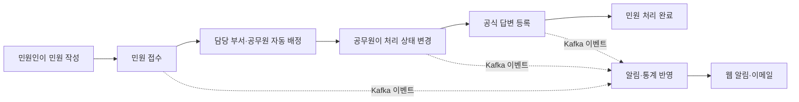
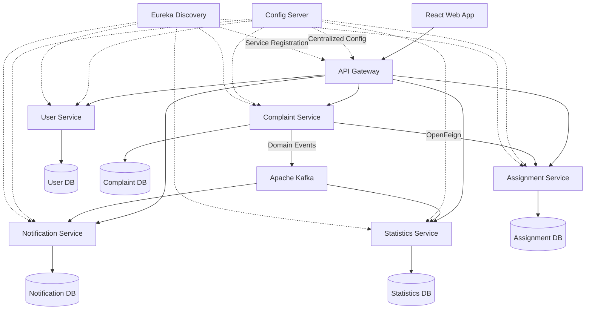
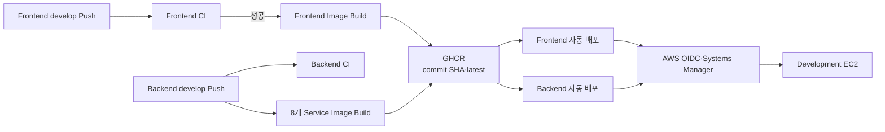

<div align="center">

# 민원온 (MinwonON)

### 접수부터 답변까지, 민원 처리 과정을 하나로 연결하는 공공 민원 통합 플랫폼

민원인과 처리 공무원 사이에 분산되어 있던 **민원 접수·자동 배정·처리·답변·알림** 절차를  
MSA 기반 서비스와 이벤트 처리로 연결한 반응형 웹 플랫폼입니다.

[Frontend Repository](https://github.com/inspire-miniproject2/frontend) · [Backend Repository](https://github.com/inspire-miniproject2/backend)

</div>

---

## 프로젝트 소개

민원온은 민원인이 신청한 민원을 적절한 담당 부서와 공무원에게 자동으로 배정하고, 처리 상태의 변화를 실시간 이벤트로 전달하는 서비스입니다. 민원인은 신청부터 답변 완료까지의 진행 상황을 확인할 수 있고, 공무원은 담당 업무함에서 민원을 처리하며, 관리자는 전체 민원 처리 현황을 통계로 확인할 수 있습니다.

공공 웹서비스에 필요한 신뢰성과 접근성을 고려하여 **KRDS(Korea Design System)** 기반 UI를 적용하고, 각 도메인의 책임과 데이터를 분리한 마이크로서비스 구조로 설계했습니다.

## 핵심 기능

| 사용자 | 제공 기능 |
| --- | --- |
| 비회원 | 회원가입·로그인, 공개된 민원 답변 목록 및 상세 조회 |
| 민원인 `CITIZEN` | 민원 작성·최종 확인·접수, 첨부파일 등록, 내 민원 목록·상세·처리 이력 조회, 알림 확인 |
| 공무원 `OFFICER` | 담당 민원 업무함 조회, 처리 상태 변경, 공식 답변 등록 및 공개 여부 설정 |
| 관리자 `ADMIN` | 공무원 민원 업무 접근, 기간·부서별 일별 통계와 처리 현황 조회 |

### 민원 처리 흐름



민원 상태는 `RECEIVED → ASSIGNED → IN_PROGRESS → COMPLETED` 순서로 전이되며, 허용되지 않은 상태 변경은 서버에서 차단합니다.

## 시스템 아키텍처



### 백엔드 서비스 구성

| 서비스 | 역할 |
| --- | --- |
| `gateway-service` | 외부 요청의 단일 진입점, JWT 검증, 권한별 라우팅 |
| `user-service` | 사용자·역할 관리, 회원가입·로그인, JWT 발급, 알림 수신 동의 관리 |
| `complaint-service` | 민원 접수·조회, 첨부파일, 처리 상태와 공식 답변 관리, Kafka 이벤트 발행 |
| `assignment-service` | 민원 분야에 따른 담당 부서·공무원 자동 배정 |
| `notification-service` | Kafka 이벤트 소비, 웹 알림 저장·읽음 처리, 조건부 이메일 발송 |
| `statistics-service` | Kafka 이벤트 기반 일별 민원 처리 통계 집계·조회 |
| `config-service` | 서비스별 설정 중앙 관리 |
| `discovery-service` | Eureka 기반 서비스 등록과 탐색 |

각 도메인 서비스는 독립된 데이터베이스를 소유하며 다른 서비스의 DB를 직접 조회하지 않습니다. 서비스 간에는 API 호출 또는 Kafka 이벤트로만 데이터를 교환합니다.

## 기술 스택

### Frontend

| 영역 | 기술 |
| --- | --- |
| Core | React 19, TypeScript 7 |
| Build | Vite 8, pnpm 11 |
| Routing | React Router 7 |
| Design System | KRDS React |
| API Mocking | MSW 2 |
| Authentication | JWT, Session Storage 기반 세션 관리 |
| UI | 반응형 웹, 1024px 축소 대응, 키보드 접근성과 상태별 UI |

프론트엔드는 기능별 API·타입을 `features`에 분리하고, 라우트 화면을 `pages` 단위로 구성했습니다. 공통 API 클라이언트가 Bearer 토큰 주입, 공통 응답 해석, 인증 오류 및 파일 다운로드를 처리합니다.

### Backend

| 영역 | 기술 |
| --- | --- |
| Core | Java 17, Spring Boot 3.5.15, Gradle |
| Cloud | Spring Cloud 2025.0.3, Gateway, Config, Eureka, OpenFeign |
| Security | JWT, Spring Security Crypto, OAuth2 JOSE |
| Data | Spring Data JPA, MariaDB 11.4, Flyway |
| Messaging | Apache Kafka 3.9.1 (KRaft), Spring Kafka |
| Mail | Spring Boot Mail, SMTP |
| Monitoring | Spring Boot Actuator |
| Test | JUnit, Spring Boot Test, H2, Embedded Kafka |

### Infrastructure & DevOps

| 영역 | 기술 |
| --- | --- |
| Local Environment | Docker, Docker Compose v2 |
| CI/CD | GitHub Actions |
| Container Registry | GitHub Container Registry (GHCR) |
| Deployment | AWS EC2, Docker Compose |
| Attachment Storage | Amazon S3 |
| Code Quality | Qodana |

## CI/CD

Frontend와 Backend 저장소는 GitHub Actions를 사용해 검증과 컨테이너 이미지 발행을 자동화합니다. Backend의 개발 환경은 이미지 발행 이후 AWS EC2 배포까지 연결됩니다.



### Frontend Pipeline
| Workflow | 실행 조건 | 주요 작업 |
| --- | --- | --- |
| CI | Pull Request 및 develop Push 시 자동 실행, 필요 시 수동 실행 | PR의 최신 커밋 제목 규칙 검사, pnpm 의존성 설치, TypeScript 타입 검사, Mock API를 비활성화한 Vite 프로덕션 빌드 |
| Frontend CD | develop Push의 CI 성공 후 자동 실행, 필요 시 수동 실행 | Docker Buildx 이미지 빌드, SBOM·Provenance 생성, GHCR 이미지 발행, AWS OIDC·SSM을 통한 개발 EC2 배포, 상태 점검 및 실패 시 롤백 |

Frontend CI는 pnpm-lock.yaml을 기준으로 고정된 의존성을 설치합니다. 이후 Mock API를 비활성화하고 VITE_API_BASE_URL=/api/v1을 적용한 프로덕션 빌드가 정상적으로 생성되는지 확인합니다.

develop 브랜치의 CI가 성공하면 ghcr.io/inspire-miniproject2/frontend에 7자리로 단축한 Commit SHA와 latest 태그로 이미지를 발행하고 개발 EC2에 자동 배포합니다. 배포 후 /health 경로를 확인하며, 배포 과정 또는 상태 점검에서 오류가 발생하면 이전 이미지로 자동 롤백합니다.

### Backend Pipeline
| Workflow | 실행 조건 | 주요 작업 |
| --- | --- | --- |
| CI | Pull Request 및 develop Push 시 자동 실행, 필요 시 수동 실행 | 최신 커밋 제목 규칙, Docker Compose 및 Shell Script 검증, Java 17 환경에서 8개 서비스 Gradle 테스트 |
| Qodana | Pull Request 및 main·develop·feature/backend-b-contracts Push 시 자동 실행, 필요 시 수동 실행 | 정적 코드 분석, GitHub Check 및 PR Annotation 제공 |
| Container Images | develop Push 시 자동 실행, 필요 시 수동 실행 | 8개 Spring Boot 서비스 이미지 빌드, GHCR에 7자리로 단축한 Commit SHA와 latest 태그 발행 |
| Deploy Development | develop 이미지 발행 성공 후 자동 실행, 필요 시 수동 실행 | GitHub OIDC로 임시 AWS 권한 획득, AWS Systems Manager를 통한 개발 EC2 배포, 전체 서비스 상태 점검 및 실패 시 롤백 |

Pull Request 단계에서 CI를 통해 소스 코드와 배포 설정을 검증합니다. 검증된 변경 사항이 develop 브랜치에 병합되면 8개 서비스의 컨테이너 이미지를 빌드하여 발행하고, 이미지 발행에 성공하면 개발 EC2에 자동 배포합니다.

수동으로 Container Images를 실행할 때는 전체 서비스 또는 특정 서비스 하나를 선택하여 이미지를 발행할 수 있습니다. develop 브랜치 Push로 자동 실행될 때는 8개 서비스 이미지를 모두 빌드합니다.

백엔드 배포는 장기 AWS Access Key를 GitHub에 저장하지 않고 GitHub OIDC를 통해 IAM Role을 위임받습니다. CI/CD 과정에서는 EC2의 SSH 포트를 사용하지 않고 AWS Systems Manager로 원격 배포 명령을 실행합니다.

실제 배포에는 latest 대신 7자리 이상의 Commit SHA 태그를 사용하여 배포 버전을 명확하게 관리합니다. 배포 후 전체 서비스 상태와 Eureka 등록, Gateway 라우팅을 점검하며, 배포 과정 또는 배포 직후 상태 점검에서 오류가 발생하면 이전 이미지로 자동 롤백합니다.


### CI/CD 운영 원칙

- `main`과 `develop`에 직접 기능 코드를 반영하지 않고 기능 브랜치와 Pull Request를 사용합니다.
- 모든 이미지에는 재현 가능한 commit SHA 태그와 편의용 `latest` 태그를 함께 발행합니다.
- 비밀번호, JWT Secret, SMTP 인증정보와 배포 자격증명은 코드가 아닌 GitHub Secrets 및 배포 환경에서 관리합니다.
- Docker Compose 설정과 실행 스크립트를 CI에서 먼저 검증해 배포 단계의 구성 오류를 줄입니다.
- 동일 브랜치의 중복 CI는 취소하고, 이미지 발행과 배포 작업은 동시에 실행되지 않도록 concurrency를 제어합니다.
- 배포 실패 시 GitHub Actions가 Systems Manager의 표준 출력과 오류를 수집하고 작업을 실패 처리합니다.

## 설계 특징

- **동기·비동기 통신 분리**: 즉시 결과가 필요한 자동 배정은 OpenFeign으로 호출하고, 알림과 통계는 Kafka 이벤트로 처리합니다.
- **서비스별 데이터 소유권**: User, Complaint, Assignment, Notification, Statistics가 각자의 DB와 스키마를 독립적으로 관리합니다.
- **이벤트 신뢰성**: 민원 생성·상태 변경·답변 등록 이벤트와 실패 메시지용 DLT를 구분합니다.
- **역할 기반 접근 제어**: Gateway와 프론트엔드 라우트 가드에서 `CITIZEN`, `OFFICER`, `ADMIN` 권한을 적용합니다.
- **API 교체가 쉬운 프론트 구조**: MSW Mock과 실제 API가 같은 요청·응답 계약을 사용하도록 기능별 타입과 호출 함수를 분리했습니다.
- **공공서비스 UI 원칙**: KRDS 컴포넌트와 토큰을 사용하고, 상태를 색상만으로 구분하지 않으며 명확한 레이블과 키보드 포커스를 제공합니다.

## 저장소

| 저장소 | 설명 |
| --- | --- |
| [frontend](https://github.com/inspire-miniproject2/frontend) | React·TypeScript 기반 반응형 웹앱, KRDS UI, 실제 API 및 MSW 연동 |
| [backend](https://github.com/inspire-miniproject2/backend) | Spring Boot 기반 MSA, 서비스별 API·DB, Kafka 이벤트, 로컬·배포 인프라 |
| [.github](https://github.com/inspire-miniproject2/.github) | GitHub Organization 프로필과 공통 커뮤니티 문서 |

## 로컬 실행 개요

### Backend

```bash
git clone https://github.com/inspire-miniproject2/backend.git
cd backend
cp .env.example .env
./scripts/start-all.sh
```

기본 진입점은 API Gateway `http://localhost:8080`이며, 전체 서비스 상태는 다음 명령으로 확인합니다.

```bash
./scripts/health-check.sh --strict
```

### Frontend

```bash
git clone https://github.com/inspire-miniproject2/frontend.git
cd frontend
pnpm install
pnpm dev
```

프론트엔드는 `http://localhost:5173`에서 실행되며 개발 서버가 `/api` 요청을 `http://localhost:8080`으로 전달합니다.

> 상세한 환경변수, 서비스 실행 순서와 테스트 방법은 각 저장소의 README를 확인해 주세요. 비밀번호, JWT Secret, SMTP 인증정보 등 민감 정보는 저장소에 커밋하지 않습니다.

---

<div align="center">

**민원 처리의 시작부터 완료까지, 더 빠르고 투명하게 — 민원온**

</div>
